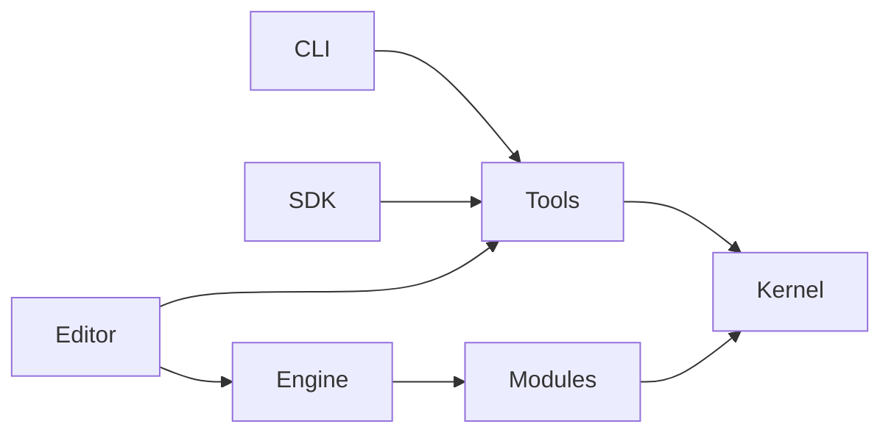
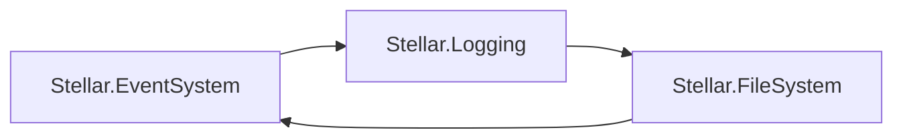
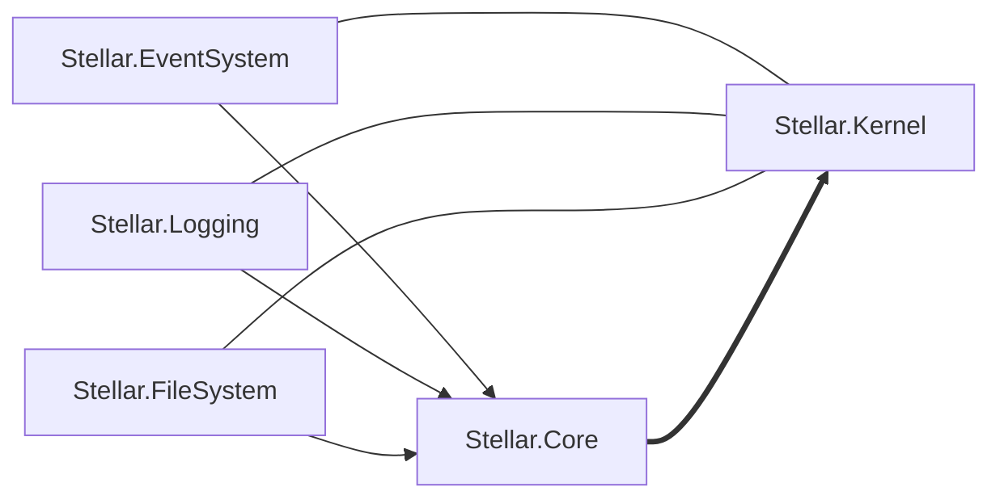

# Architecture Overview

- [README.md](./../../README.md)

## Kernel

The basic contract layer is used to divide the engine into modules and help combine them into one structure.\
> The Kernel is not a module!\
> The Kernel is the engine layer present in all parts of the engine

- Stellar.The kernel is a basic core that has all the necessary contracts for Design-time, Build-time, and Core engine modules (including
  Stellar.Core)
- Stellar.{Module}.Kernel - The contract kernel for a specific High-level engine module
  What is it for, an example:

Ring dependency in modules is exactly what the Kernel solves. The first module with business logic helps him.
Stellar.Core

## Modules

The engine modules are provided by 4 main levels (where 0 is the Kernel):

0) Kernel - see above
1) Core module - the first module that serves as the core of the entire system.
2) Core modules - several separate systems divided into independent modules
3) RuntimeSystem - a system that controls the behavior of the engine during execution
4) High-Level modules - the main modules representing the main API
   Each of these levels can only communicate directly with the lower ones, i.e. Core cannot access Stellar.Graphic.
   The only exception is Stellar.RuntimeSystem due to the specifics of its basic concept.

## Engine

The Engine itself is a separate project, a collection that provides basic interfaces for connecting to the initialization
of the engine and its main cycle.

## Tools

This is a binary library that knows about contracts and knows how to work with them, for example, creating its own interfaces based on them.
At the moment, Tools has a weak implementation, but in the future it will have such as:

- Generation of configuration files and monitoring of their status, for example key-bindings
- Asset assembly (the part of the AssetPipeline responsible for this)
- other small algorithms running during development

## CLI

Simple .NET tools wrapper on top of Tools

## SDK

Complex wrapper on top .NET 9.0 SDK. This part of the SSK is used to simplify the project build, allowing you to automatically
connect the necessary set of modules and libraries, while simplifying versioning and standard generation for runtime.\
The SDK also includes the Roslyn analyzer, which is also poorly implemented at this stage. His responsibility is to simplify
the work with the engine and keep the code clean.
In addition to the analyzer, it is planned to add a generator. In the future, it can help with the generation of a launcher for your
program or with the integration of C# scripts.

## Editor

This is an example of an engine consumer. Hyper-modularity and re-usability will have to make it possible to write an Editor directly on
the engine itself. This action should help with the integration of Debugger and Profiler projects, but also with other non-obvious ones.
tasks. An example is the simplification of embedding a game artifact in the editor and vice versa.

## SSK - Stellar Software Kit

All this adds up to the SSK (or SSDK - Stellar Software Development Kit), a set of tools to simplify
the integration of the engine and its use in development