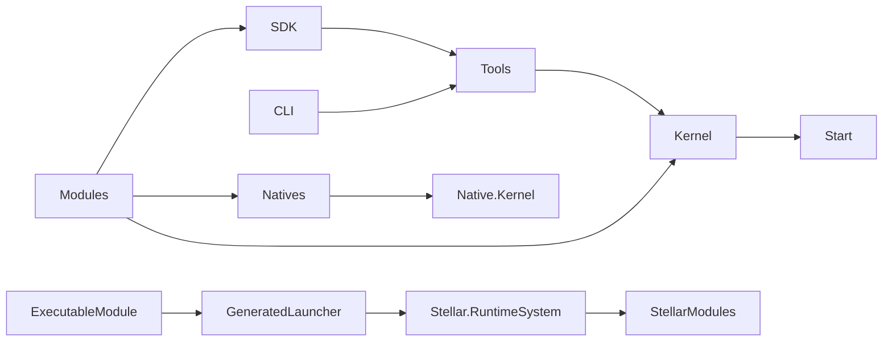
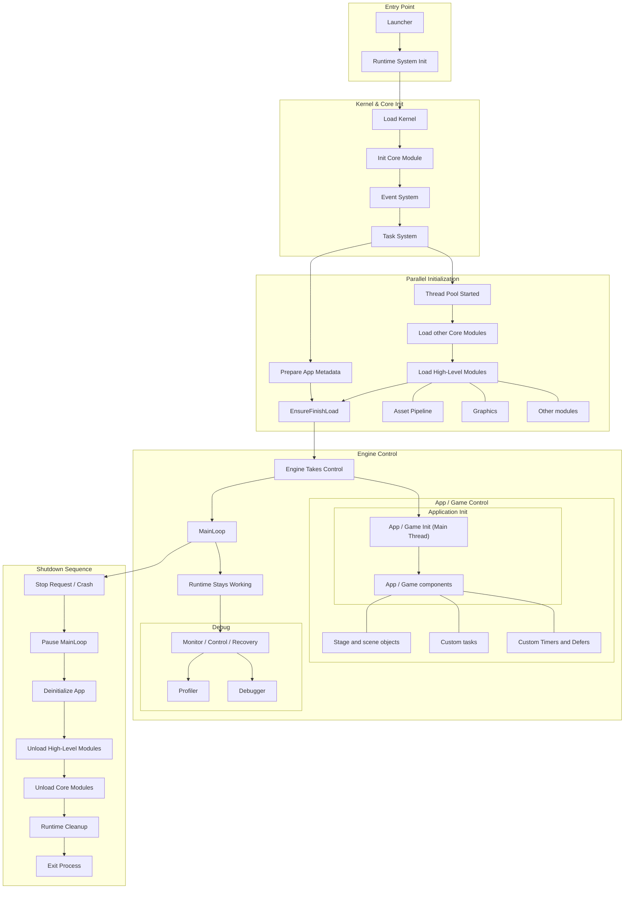

# Engine pipeline

- [README.md](./../../README.md)

## Installing & Building

```mermaid
flowchart LR
    Tools --> Kernel --> Start
    SDK --> Tools
    CLI --> Tools
    Modules --> Kernel
    Modules --> Natives --> Native.Kernel
    Modules --> SDK
    
    ExecutableModule --> GeneratedLauncher --> Stellar.RuntimeSystem --> StellarModules
```

## Runtime lifecycle

```mermaid
flowchart TD

%% ======================
%% ENTRY
%% ======================
    subgraph ENTRY ["Entry Point"]
        Launcher --> RuntimeInit["Runtime System Init"]
    end

%% ======================
%% KERNEL INIT
%% ======================
    subgraph KERNEL ["Kernel & Core Init"]
        RuntimeInit --> KernelLoad["Load Kernel"]
        KernelLoad --> CoreModule["Init Core Module"]
        CoreModule --> EventSystem["Event System"]
        EventSystem --> TaskSystem["Task System"]
    end

%% ======================
%% PARALLEL INIT
%% ======================
    subgraph PARALLEL ["Parallel Initialization"]
        TaskSystem --> Metadata["Prepare App Metadata"] --> EnsureFinishLoad
        TaskSystem --> ThreadPool["Thread Pool Started"] --> LoadCoreModules["Load other Core Modules"] --> HighModules["Load High-Level Modules"]
        HighModules --> EnsureFinishLoad
        HighModules --- AssetPipeline["Asset Pipeline"]
        HighModules --- Graphics["Graphics"]
        HighModules --- Other["Other modules"]
    end

%% ======================
%% ENGINE CONTROL
%% ======================
    subgraph ENGINE ["Engine Control"]
        EnsureFinishLoad --> EngineStart["Engine Takes Control"]
        EngineStart --> MainLoop["MainLoop"] --> RuntimeAlive["Runtime Stays Working"] --> Monitor["Monitor / Control / Recovery"]
        EngineStart --> AppInit
    %% ======================
    %% GAME CONTROL
    %% ======================
        subgraph GAME ["App / Game Control"]
        %% ======================
        %% APP INIT
        %% ======================
            subgraph APP ["Application Init"]
                AppInit["App / Game Init (Main Thread)"] --> AppComponentsInit["App / Game components"]
            end
            AppComponentsInit --- Stage["Stage and scene objects"]
            AppComponentsInit --- CustomTasks["Custom tasks"]
            AppComponentsInit --- TimersAndDefers["Custom Timers and Defers"]
        end

    %% ======================
    %% DEBUG SYSTEMS
    %% ======================
        subgraph DEBUG["Debug"]
            Monitor --> Profiler["Profiler"]
            Monitor --> Debugger["Debugger"]
        end
    end

%% ======================
%% SHUTDOWN
%% ======================
    subgraph SHUTDOWN ["Shutdown Sequence"]
        MainLoop --> StopRequest["Stop Request / Crash"] --> Pause["Pause MainLoop"] --> DeinitApp["Deinitialize App"]
        DeinitApp --> UnloadHigh["Unload High-Level Modules"] --> UnloadCore["Unload Core Modules"]
        UnloadCore --> RuntimeExit["Runtime Cleanup"] --> Exit["Exit Process"]
    end
```